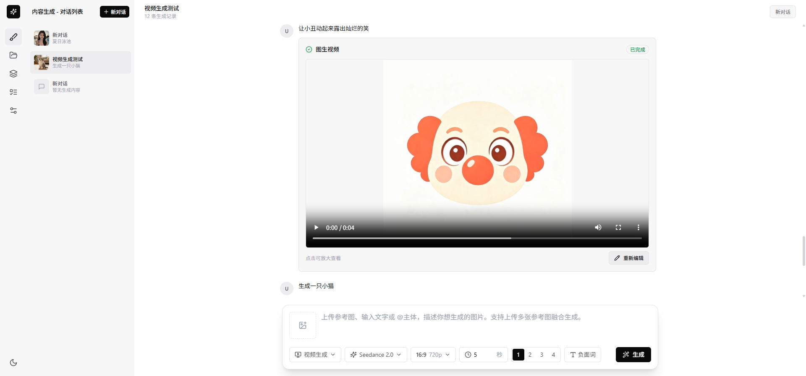

<div align="center">
  

  <h1>Open Dreamina</h1>

  <p><strong>简单够用的 AIGC 创作工具</strong></p>

  <p>
    受 <a href="https://jimeng.jianying.com/">即梦</a> 启发而设计开发，以浏览器应用的形式提供服务。
  </p>

  <p>
    
    
    
  </p>
</div>

---

## 已接入模型

| 模型名称 | 简介 |
| --- | --- |
| GPT Image 2 | OpenAI 图片生成模型，支持文生图与图生图，可经 OpenRouter 等兼容网关接入。 |
| Seedream 5.0 | 火山引擎豆包文生图模型，支持高质量图像生成与编辑。 |
| Seedance 2.0 | 火山引擎豆包视频生成模型，支持文生视频与图生视频。 |
| Seedance 2.5 | 火山引擎豆包视频生成模型，支持文生视频与图生视频。 |
| 即梦 Seedream（CLI） | 通过本机即梦 CLI 生成图片，复用本机登录态，无需 API Key。 |
| 即梦 Seedance（CLI） | 通过本机即梦 CLI 生成视频，复用本机登录态，无需 API Key。 |
| Seedream（Spark Hub 中转） | 经 Spark Hub 中转站调用 Seedream 生图模型（Seedream 5 / 5 Pro），统一异步任务模式。 |
| Seedance（Spark Hub 中转） | 经 Spark Hub 中转站调用 Seedance 生视频模型（Seedance 2 / 2 Fast / 2 Mini / 2.5），统一异步任务模式。 |
| Stability AI | Stability 图像生成模型服务。 |
| 通义万相 | 阿里云通义万相图像/视频生成模型服务。 |
| 可灵 | 快手可灵视频生成模型服务。 |

---

## 特性

- **干净无广告** —— 专注创作，没有干扰
- **设计克制** —— 谨慎增加按钮和确认环节
- **免注册开箱即用** —— 无需注册即可使用
- **数据本地保存** —— 数据保存在本地，无需二次下载
- **一键部署** —— 支持 Windows / Linux / macOS，一键启动
- **模型灵活接入** —— 自由选择 AIGC 模型服务，提供 API 调用记录统计与分析
- **性能与体验领先** —— 核心功能的性能和使用体验达到同类产品领先水平（排除模型服务带来的差异）



---

## 快速开始

### 本地智能体一键部署

> 使用 codex, workbuddy 等 AI 智能体，复制下面这句话发给它，即可自动完成安装部署：
>
> ```text
> 克隆 https://github.com/Token-Spark/open-dreamina 到本地，按照仓库 AGENTS.md 引导完成部署，最后告诉我访问地址。
> ```

### 脚本部署
服务通过 Docker Compose 编排，包含前端、后端、Celery 任务队列与 Redis。首次部署只需一条命令，脚本会自动完成：

> 环境检查 → 生成 `.env`（含随机加密密钥）→ 构建镜像 → 启动服务 → 健康检查

**Linux / macOS 脚本部署**
```bash
bash deploy.sh
```

**Windows 脚本部署（推荐三步走）**

1. **安装/确认 Docker Desktop**：从 [Docker 官网](https://www.docker.com/products/docker-desktop/) 下载安装，启动后等待左下角显示 `Engine running`。
2. **（推荐）安装 PowerShell 7**：避免 Windows 自带 PowerShell 5 的中文编码兼容问题。安装后执行：
   ```powershell
   pwsh .\deploy.ps1
   ```
   下载地址：[https://aka.ms/powershell](https://aka.ms/powershell)
3. **直接部署**：若坚持使用 PowerShell 5，请在项目根目录执行：
   ```powershell
   .\deploy.ps1
   ```

> 首次部署前，可先运行环境检查（不构建镜像）：
> ```powershell
> .\deploy.ps1 -Check
> ```
>
> 若提示脚本被禁止执行，先运行 `Set-ExecutionPolicy -Scope Process Bypass` 再执行。


### 环境要求

- 已安装 [Docker](https://docs.docker.com/get-docker/)（Windows / macOS 使用 Docker Desktop，Linux 使用 Docker Engine）
- Docker Compose 插件（Docker Desktop 与新版 Docker Engine 已内置）
- **Windows 用户**：Docker Desktop 默认使用 WSL 2 后端，请确保：
  - 系统已启用虚拟化（Hyper-V / 虚拟机平台）；
  - WSL 2 内核已更新到最新版（首次安装 Docker Desktop 时通常会提示）；
  - 不建议在 WSL 发行版内部再单独安装 Docker Engine，否则可能与 Docker Desktop 的 WSL 2 后端冲突，导致引擎无法连接。
- 端口 `10131`（前端）、`10130`（后端）未被占用

### Windows 常见问题

| 现象 | 可能原因 | 解决方案 |
| --- | --- | --- |
| 运行 `deploy.ps1` 后出现中文乱码或解析错误 | Windows PowerShell 5 默认按 GBK 代码页读取无 BOM 的 UTF-8 脚本 | 安装 PowerShell 7 后执行 `pwsh .\deploy.ps1`；或确保 `deploy.ps1` 以 UTF-8 with BOM 保存 |
| Docker 已安装，但脚本提示"无法连接到 Docker 引擎" | Docker Desktop 引擎未启动，或 WSL 2 后端异常 | 1. 打开 Docker Desktop 等待左下角显示 `Engine running`；<br>2. 执行 `wsl --update && wsl --shutdown` 后重启 Docker Desktop；<br>3. 若 WSL 内独立安装过 Docker，请卸载或禁用 |
| Docker Desktop 弹出"计算机无法连接到远程计算机" | WSL 2 后端初始化失败或 RemoteApp/RDP 相关组件异常 | 执行 `wsl --update` 更新 WSL 2 内核；确保 Hyper-V 与虚拟机平台功能已启用；必要时重启 Windows |
| 健康检查超时 | 服务首次启动较慢，或端口被占用 | 执行 `docker compose logs -f` 查看具体错误；确认端口 `10131`/`10130` 未被占用 |

### 部署完成后

| 操作 | 命令 / 地址 |
| --- | --- |
| 访问应用 | <http://localhost:10131> |
| API 文档 | <http://localhost:10130/docs> |
| 查看日志 | `docker compose logs -f` |
| 停止服务 | `docker compose down` |
| 更新服务 | 重新执行部署脚本（`--build` 会重建镜像，确保前端静态资源为最新） |

### 常用运维命令

```bash
# 查看各服务状态
docker compose ps

# 重启某个服务（如 celery-worker 改代码后）
docker compose restart celery-worker

# 查看某个服务日志
docker compose logs -f backend

# 停止并删除容器（数据保留在 ./data 目录）
docker compose down
```

---

## 使用引导

### 首次使用

打开 <http://localhost:10131> 即可直接使用，无需注册登录。所有数据（对话、生成记录、API Key）均保存在本地 `./data` 目录。

### 配置模型服务

进入「设置 → 服务管理」，选择并激活你使用的 AIGC 模型服务（如即梦、通义万相、可灵、Stability 等），填入对应的 API Key。API Key 会使用 `.env` 中的 `ENCRYPTION_KEY` 加密后存储。

### 即梦 CLI（可选）

若使用即梦 CLI 作为模型服务，需在运行 `celery-worker` 的机器上安装 CLI 并完成登录：

1. 进入「设置 → 服务管理 → 即梦 CLI」，点击「安装」；
2. 安装完成后点击「登录」，按页面提示完成授权；
3. 登录态保存在 `./data/dreamina-home`，容器重建后不丢失。

> 注意：CLI 需安装在 celery-worker 所在机器上，且 `dreamina login` 需手动完成授权（自动发起的登录链接可能存在兼容问题）。

### 数据备份

进入「设置」可手动触发数据库备份，备份文件保存在 `./data/backups`（默认保留最近 3 份）。

---

## 社区交流

<div align="center">
  <p>扫描下方二维码，加入飞书话题群，获取使用帮助与最新动态：</p>
  
</div>
